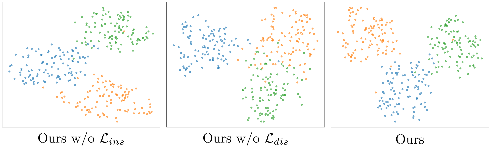

# Supplementary Material for SeAM: Self-Adaptive Matching for Few-shot Image Generation

We apologize for taking up your time. Due to limitations on length and format, we provide additional links to further explain the issues in the paper. We sincerely appreciate your patience in reviewing it.

## Q1: Measurement of distribution rotation.

For better evaluation, we also visualize generated results w/ and w/o our rotation strategy as follows. 

We can see that without applying rotation, the generated results tend to overfit, closely matching the tonal and expressive characteristics of the target domain training set. In contrast, with the addition of rotation, the generated images exhibit distinct features from the source domain, such as skin tone. This demonstrates the beneficial impact of rotation on the quality and diversity of the generated outcomes.

## Q2: Difference from CDC.

CDC pushes the pairwise generated samples of the target and source domains together, i.e., measuring the similarities of pairwise generated samples in a batch to approximately measure the distance between distribution P_s and P_t, which could result in over-enforcement of content information from the source domain. In our method, we evaluate the distance between the distribution grounded in transport theory, which can effectively transfer valuable content information while avoiding the inclusion of overly aggressive attribute information from the source domain. To better demonstrate the effectiveness of our method, we add the ablation study as follows:

| CDC Distribution Loss | Ours Distribution Loss | Babies | Sunglasses | MetFaces |
|-----------------------|------------------------|--------|------------|----------|
| ×                     | ×                      | 43.91  | 37.41      | 60.32    |
| √                     | ×                      | 41.65  | 31.58      | 55.17    |
| ×                     | √                      | 37.16  | 24.98      | 46.03    |

We conducted pre-training on the FFHQ dataset and then transferred it to three different target domains for ablation studies. We chose the FID metric as our evaluation criterion (a lower FID indicates better generation quality). The experimental results show that using our distribution loss significantly improves generation quality compared to the CDC loss.

## Q3: Visualized Analysis of the actual feature distribution

To further illustrate the actual effects of the two losses we proposed, we utilized the labels provided in the [FFHQ features dataset](https://github.com/DCGM/ffhq-features-dataset) as our reference. We visualize the feature distribution of our method on FFHQ dataset by t-SNE. Here, we utilize the labels provided in the FFHQ features dataset as our reference. Specifically, we selected three mutually exclusive classes—non-smiling, non-glasses-wearing females; smiling, non-glasses-wearing males; and non-smiling, glasses-wearing males. We compare the feature distribution of our method w/ and w/o our proposed two specific losses. 

From the visualization results, we can see that when the local-scale self-adaptive rotation ($L_{ins}$) is not applied, the shape of the class changes. This indicates that without the local-scale constraint, the features within the class become more dispersed. When global-scale optimal distribution matching ($L_{dis}$) is not applied, the relationship between classes collapses. This indicates that without the global-scale constraint, the relationships between classes are affected. It significantly demonstrates that our proposed losses can achieve the goal we have claimed.